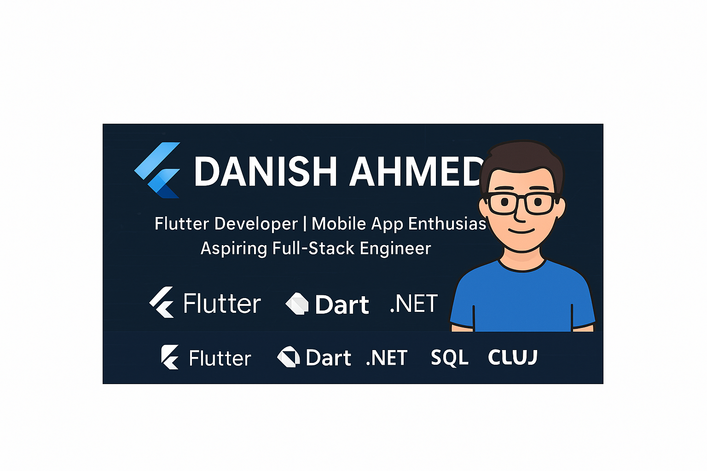

# 👋 Hi, I'm Danish Ahmed  

  

💻 **Flutter Developer | Mobile App Enthusiast | Aspiring Full-Stack Engineer**  

I specialize in building **cross-platform mobile applications with Flutter & Dart**, integrating them with modern APIs and robust backends.  
Alongside Flutter, I also work with **.NET, ASP.NET, and SQL Server** to deliver complete solutions.  

---

## 🔹 Tech Stack & Tools

---

## 🔹 Featured Projects
📱 **Risk Conquest (FYP)** – Full-stack project with:  
   - Flutter UI (custom widgets, responsive design)  
   - APIs in .NET + ADO.NET  
   - SQL Server database  

🤖 **Intent Detection Software** – Natural language detection using **Python + OpenAI API**  

🏠 **Rental Management System** – Desktop solution built with **Windows Forms (.NET)**  

---

## 🔹 Personal Traits
✨ Strong problem-solving & debugging  
✨ Fast learner, eager to explore new tech  
✨ Effective communication & teamwork  
✨ Detail-oriented, able to work under pressure  

---

## 🔹 Education
🎓 **BSCS** – PMAS Arid Agriculture University, Rawalpindi  

---

## 🔹 Let’s Connect
📧 **Email:** [danishahmed5522@gmail.com](mailto:danishahmed5522@gmail.com)  
🔗 **LinkedIn:** [linkedin.com/in/notdanishahmed](https://www.linkedin.com/in/notdanishahmed)  

---

